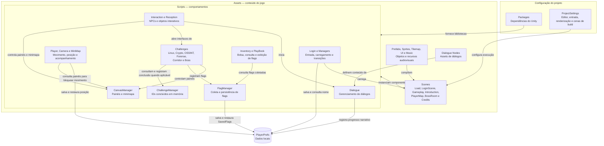

# Projeto CyberLace CTF game - Ladies in Cyber 

Jogo 2D desenvolvido em Unity e C# que combina exploração, diálogos com NPCs e desafios de cibersegurança no formato Capture the Flag (CTF). A jogadora percorre ambientes, investiga pistas e coleta flags, com acesso a inventário, playbook e uma etapa final na sala do boss.

Esta documentação descreve a estrutura e os comportamentos implementados na branch `collab/julia-polyana-map`.

## Funcionalidades

- Movimentação 2D, animações da personagem, câmera e minimapa.
- Identificação da jogadora por nome, exibido na interface e utilizado nos diálogos.
- Interação com NPCs, objetos e computadores.
- Diálogos com escolhas e condições de progressão.
- Desafios de Linux, criptografia, OSINT e forense digital.
- Terminal Bash simulado com arquivos e diretórios virtuais.
- Inventário de flags, playbook com páginas de consulta e recurso de cópia de texto.
- Salvamento local de nome, flags, posição e determinados eventos de progresso.
- Sala do boss, transições visuais, música e créditos.

## Tecnologias

| Componente | Versão / uso |
| --- | --- |
| Unity Editor | **2022.3.62f3** |
| C# | Scripts de comportamento e regras do jogo |
| WebGL | disponilização web |
| Universal Render Pipeline | 14.0.12 |
| Cinemachine | 2.10.5 |
| TextMesh Pro | 3.0.7 |
| Unity UI (uGUI) | 1.0.0 |
| Unity 2D | Sprites, física 2D e tilemaps |


A versão do editor está em [ProjectVersion.txt](ProjectSettings/ProjectVersion.txt). As dependências são controladas por [manifest.json](Packages/manifest.json) e [packages-lock.json](Packages/packages-lock.json). O projeto utiliza o sistema clássico de entrada do Unity (`Input Manager`).

## Como executar

### Pré-requisitos

- Git para obter o repositório.
- Unity Hub com o **Unity 2022.3.62f3** instalado.
- Módulo de suporte WebGL ou à plataforma desejada, caso vá gerar uma build.
- Acesso à internet para baixar dependências durante a primeira importação.

### Abrir no editor

1. Obtenha o repositório e selecione a branch mais atualizada até o momento`collab/julia-polyana-map`.
2. No Unity Hub, adicione a pasta raiz que contém `Assets`, `Packages` e `ProjectSettings`.
3. Abra o projeto com a versão indicada do Unity e aguarde a importação dos assets e pacotes.
4. Abra a cena [Load.unity](Assets/Scenes/Load.unity).
5. Pressione **Play** no editor.

`LoadScenes` verifica o nome salvo em `PlayerPrefs`: sem nome, abre `LoginScene`; com nome, direciona para `PlayerMap`. Na primeira entrada, o nome informado leva à cena `Gameplay`, e a navegação de boas-vindas/tutorial conduz ao mapa.

Para reproduzir o fluxo de entrada, comece por `Load`. Abrir diretamente outras cenas pode depender de dados e objetos inicializados anteriormente.

## Controles

| Entrada | Ação |
| --- | --- |
| WASD ou setas | Mover a personagem |
| E | Interagir com objetos/NPCs próximos e avançar determinados diálogos |
| Mouse | Selecionar escolhas, navegar pelos painéis e usar os botões da interface |
| Teclado nos campos de texto | Informar nome, respostas e comandos do terminal |
| Ctrl + U | Ação específica do painel de e-mail no desafio SheepSkin |

O movimento é bloqueado enquanto os painéis registrados no `CanvasManager` estão abertos. As ações disponíveis dependem do contexto e da proximidade com o objeto.

## Cenas

As cenas habilitadas em [EditorBuildSettings.asset](ProjectSettings/EditorBuildSettings.asset) estão nesta ordem:

| Cena | Responsabilidade |
| --- | --- |
| `Load` | Carregamento inicial e seleção entre login e mapa |
| `LoginScene` | Entrada do nome da jogadora |
| `Gameplay` | Boas-vindas e interface de entrada/tutorial |
| `Introduction` | Apresentação narrativa, com carregamento aditivo previsto nos scripts |
| `PlayerMap` | Exploração do mapa, NPCs e desafios |
| `BossRoom` | Etapa final e interações do boss |
| `Credits` | Créditos do jogo |

A ordem de build não representa necessariamente a sequência narrativa: os scripts determinam as transições. A configuração também contém uma referência desabilitada a `IntroductionGame.unity`, que não faz parte das cenas habilitadas.

## Estrutura do projeto

```text
Assets/
├── Scenes/                  # Cenas do jogo
├── Scripts/
│   ├── Camera/              # Configuração da câmera
│   ├── Challenges/          # Desafios e progressão
│   │   ├── Boss/            # Diálogos, computador e acesso à sala final
│   │   ├── Corridor/        # Interações no corredor
│   │   ├── Crypto/          # Desafios de criptografia
│   │   ├── Forense/         # BlackBox e SheepSkin
│   │   ├── Linux/           # Terminais e desafios Linux
│   │   └── OSSINT/          # Validação do desafio OSINT
│   ├── Credits/            # Rolagem dos créditos
│   ├── Dialogue/           # Nós e gerenciadores de diálogo
│   ├── Effects/            # Efeitos de texto e interface
│   ├── Interaction/        # Interações com objetos e NPCs
│   ├── Inventory/          # Flags, bolsa, playbook e cópia de texto
│   ├── Login/              # Nome, boas-vindas e tutorial
│   ├── Managers/           # Cenas, música, transições e interface
│   ├── MiniMap/            # Minimap e elementos associados
│   ├── Player/             # Movimento, identificação e posição
│   ├── Reception/          # Interação na recepção
│   └── Utils/              # Utilitários de renderização
├── Dialogue Nodes/         # Assets de diálogos
├── Prefabs/                # Objetos reutilizáveis
├── Sprites/                # Imagens de personagens e objetos
├── Tilemap/                # Recursos de mapas
├── UI/                     # Recursos visuais da interface
├── Music/                  # Áudio
├── Plugins/                # Integrações adicionais
├── StreamingAssets/        # Arquivos distribuídos com o jogo
└── Backup/                 # Cópias de recursos de desenvolvimento
Packages/                   # Manifesto e resolução de dependências
ProjectSettings/            # Configurações do Unity
```

O nome `OSSINT` acima corresponde ao diretório existente no repositório.

## Organização dos sistemas

### Diagrama de arquitetura

O diagrama agrupa as principais partes do projeto e mostra suas relações. As setas indicam uso, configuração ou fluxo de dados, conforme o rótulo; não representam uma sequência obrigatória de cenas nem todas as dependências entre classes.



`CanvasManager`, `FlagManager` e `PersistentInventory` usam `DontDestroyOnLoad` para manter seus objetos entre cenas. Essa persistência durante a execução é diferente do armazenamento em `PlayerPrefs`, que permite recuperar dados em outra sessão. O diagrama resume os módulos; configurações específicas também ficam serializadas nas cenas e nos prefabs.

### Jogadora e interface

`PlayerMovement` usa `Rigidbody2D`, `Animator` e `SpriteRenderer` para movimentação e animação. `PlayerNameManager` grava o nome, e `PlayerNameplate` controla sua apresentação. `DataPlayerPosition` salva e restaura coordenadas por cena.

`CanvasManager` centraliza o controle de painéis. Os componentes de inventário administram a bolsa, a exibição de flags e o playbook. Há também o componente [PersistentInventory.cs](Assets/PersistentInventory.cs), localizado diretamente em `Assets`.

### Diálogos e progressão

Os scripts em `Dialogue` e os assets em `Dialogue Nodes` definem os diálogos. Interações de NPCs e objetos acionam esses fluxos conforme proximidade e estado do jogo.

`NPCJoanaInteraction` libera a interação de progressão quando a lista contém pelo menos oito flags, ou quando seu modo de depuração está habilitado. A verificação usa a contagem da lista. `UnlockBossRoom` valida uma senha e controla o desbloqueio e a transição para a sala final.

### Desafios

| Área | Implementação |
| --- | --- |
| Linux | `BashTerminalBase`, `TerminalMercado` e `TerminalPressaoNoBash` |
| Criptografia | `CryptoPassword`, `PCPChallenge` e navegação de arquivos/pastas |
| OSINT | `ValidatePassword`, em `Challenges/OSSINT` |
| Forense | Painéis e computadores dos desafios `BlackBox` e `SheepSkin` |
| Boss | Diálogos próprios, login de computador, interações e `TerminalBoss` |

O terminal implementa comandos como `ls`, `cd`, `pwd`, `cat`, `mkdir`, `touch`, `clear`, `help` e `exit` sobre um ambiente virtual. As regras e o conteúdo variam conforme o desafio. `TerminalBoss` está no diretório `Challenges/Linux/Terminal/TerminalBash`, apesar de atender à etapa final.

### Persistência

O armazenamento local utiliza `PlayerPrefs` e inclui:

- `PLAYER_NAME`: nome da jogadora.
- `SavedFlags`: flags coletadas, serializadas com o separador `|`.
- Chaves de posição por cena, como `PlayerMap_PlayerX`, `PlayerMap_PlayerY` e `PlayerMap_PlayerZ`.
- Estados específicos de introdução, diálogos e desbloqueio da sala do boss.

`FlagManager` mantém uma instância entre cenas e evita duplicar a mesma combinação de nome do desafio e flag. Já `ChallengeManager` guarda IDs concluídos em um `HashSet` em memória, sem implementar salvamento próprio. Portanto, flags persistidas e conclusão de desafios são estados distintos.

A tela de login registra um nome local. Ao finalizar, o inventário oferece um botão para abrir a plataforma externa de CTF, cujo endereço está definido em `InventoryManager`.

## Como gerar uma build

1. Abra **File > Build Settings** no Unity.
2. Confira as sete cenas habilitadas descritas acima, mantendo `Load` como primeira cena habilitada.
3. Selecione a plataforma de destino (WebGL) e instale seu módulo pelo Unity Hub, se necessário.
4. Use **Switch Platform** quando for preciso trocar de plataforma.
5. Revise as opções em **Player Settings**.
6. Use **Build** ou **Build And Run** e escolha uma pasta de saída fora de `Assets`.

Existe código específico para teclado em WebGL no desafio SheepSkin. A presença desse código não substitui a validação da build no navegador e na plataforma escolhida.

## Desenvolvimento e validação

- Preserve os arquivos `.meta` ao mover ou compartilhar assets; suas referências dependem dos GUIDs do Unity.
- Ao alterar componentes, confira as referências serializadas no Inspector e os eventos dos botões.
- Ao adicionar cenas, registre-as em Build Settings e confira os nomes utilizados pelos scripts.
- Ao criar desafios, confira a integração com `FlagManager`, `ChallengeManager`, diálogos e interface.
- Considere os dados existentes em `PlayerPrefs` ao testar os fluxos de primeira entrada e retorno.
- Não versione pastas geradas pelo Unity, como `Library` e `Temp`.

Sugestão de verificação manual após mudanças:

1. Executar a cena `Load` com e sem um nome previamente salvo.
2. Verificar movimento, colisões, câmera e bloqueio de movimento durante diálogos.
3. Abrir e fechar inventário, playbook e painéis dos desafios.
4. Concluir um desafio e conferir a flag no inventário após reabrir o jogo.
5. Verificar as condições de acesso ao boss, as transições e a chegada aos créditos.
6. Repetir os fluxos afetados na build de destino.

## DEsenvolvedoras
- Para suporte, contacte as desenvolvedoras do projeto:

| Desenvolvedora | GitHub | E-mail de contato |
| --- | --- | --- |
| Julia Azevedo | [@juliaazeved0](https://github.com/juliaazeved0) | [juliacarolineazevedo@gmail.com](mailto:juliacarolineazevedo@gmail.com) |
| Polyana Neuland | [@polyneuland](https://github.com/polyneuland) | [neulandpoly@gmail.com](mailto:neulandpoly@gmail.com) |
